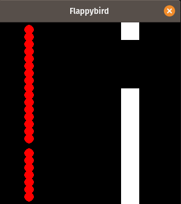

# flappy-bird-AI

Evolutionary algorithm training a flappy bird AI. Each bird, as a red ball, is controlled by a multilayer perceptron to perform two actions: jump or nothing. A population of birds is initialized at random and perform until all the birds died. After that, a new generation of birds is created using crossover and mutation of the members of the previous generation.

## Installation

Use the package manager [pip](https://pip.pypa.io/en/stable/) to install flappy-bird-AI.

```bash
pip install -r requirements.txt
```

## Usage

You can start and visuialize the training using (an almost perfect bot should be created within 50 generations):

```python
python game.py
```

 | [last survivor](images/demo-begin.png)
